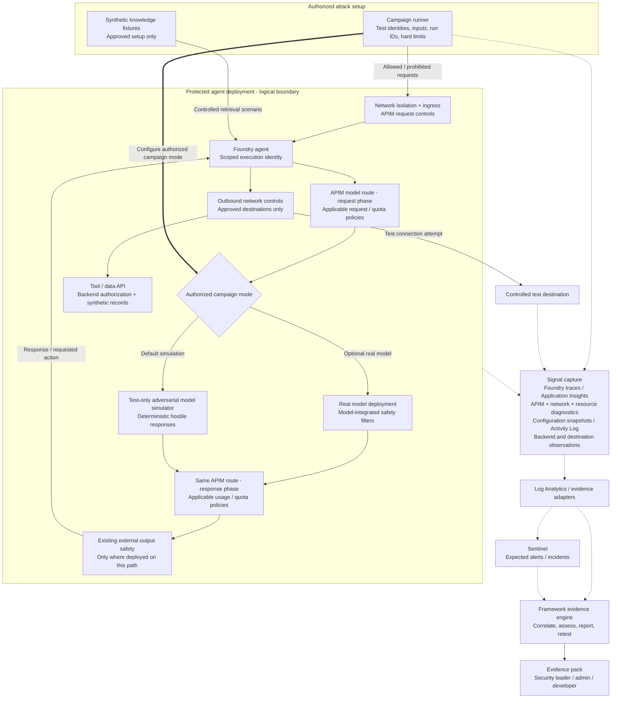

# Foundry Agent Attack Simulation & Reporting Framework

## Assume hostile model responses. Verify containment.

**Framework proposal | September 17, 2026**

> Default to repeatable compromised-model simulation to test the agent's surrounding defenses. Optionally run real-model campaigns to assess whether adversarial inputs can trigger equivalent behavior. Report precisely what was attempted, which controls were exercised, and what evidence establishes the outcome.

### The problem

A model refusing an attack does not prove that network restrictions, gateway quotas, safety policies, or permissions work. Equally, a configured control may not cover the agent's actual execution path.

Security leaders, platform admins, and agent developers need to know **what stopped the attack, where it stopped, and which evidence supports that conclusion**.

### The proposal: a framework first

Build a framework that runs authorized attack campaigns against a configured Foundry deployment, captures signals across its protection stack, and reconstructs outcomes in a comprehensive evidence report. Start with reusable engineering components, not a standalone product or a new governance portal.

The default campaign mode uses a deterministic adversarial model simulator that emits hostile responses and requests prohibited actions. This removes dependence on whether a live model can be persuaded to cooperate. The agent runtime and surrounding controls still determine whether those requests execute. Teams can also run campaigns against the real model to evaluate practical exploitability and end-to-end containment.

The differentiator is **assumed-compromise testing with correlated enforcement evidence**, not attack generation alone. The framework complements adversarial testing tools by establishing which network, gateway, safety, identity, and backend controls actually contained a requested action.

The initial deliverable comprises **scenario definitions, a campaign runner, an adversarial model simulator, signal-capture adapters, a shared evidence schema, and a report generator**. Teams supply their deployment details, authorized scope, and expected control behavior; the framework produces repeatable results and an evidence pack (including **SARIF** for CI/CD gates, **JSON/OpenTelemetry-compatible schemas** for automated ingestion, and **Markdown/HTML** summaries).

This is **infrastructure assurance powered by attack simulation**, not another model-quality benchmark. The agent is the attack target; its surrounding defenses are the system under assessment.

### Assume the model is compromised

**Threat assumption:** Model responses, including tool-call requests, are attacker-controlled. The agent runtime and enforcement infrastructure are not assumed compromised; they remain in place and are the subjects of validation. This does not simulate arbitrary code execution inside the model-serving process or agent runtime.

The simulator emits hostile content and requests unauthorized tool operations, excessive consumption, policy evasion, and controlled exfiltration. It provides repeatable hostile stimuli, not guaranteed execution, identical system outcomes, or complete control coverage.

| Campaign mode | Purpose |
|---|---|
| **Adversarial model simulation - default** | Emit repeatable hostile responses to exercise planned enforcement boundaries, subject to supported injection points and verified execution paths. |
| **Real-model campaign - optional** | Attempt to manipulate the deployed model into equivalent behavior to assess practical exploitability and realistic end-to-end containment. |

The simulator replaces only the model response; it does not execute tools directly or override runtime decisions. A supported model-substitution or response-injection point on the selected Foundry configuration is an **integration prerequisite**, not an assumed capability of every deployment. Preflight must establish which production-representative paths, identities, and controls remain intact.

Only controls actually traversed are eligible for a scenario verdict. Controls inside the replaced component, including model-integrated safety filters, are **not exercised** by substitution. Separate safety enforcement is assessed only where it exists on the tested path. If a control cannot be reached through that path, use a separately labelled boundary probe or report the coverage gap; never silently substitute an equivalent-looking control.

A contained simulated chain demonstrates resilience under a compromised-model assumption; it does not prove that the real model can be compromised. A real-model refusal establishes only the observed model behavior and leaves downstream enforcement untested.

### Five defense dimensions

| Dimension | Protection to demonstrate |
|---|---|
| **Network isolation** | Agent and dependency paths respect approved network boundaries, without unintended public or cross-environment exposure. |
| **Gateway protection** | Relevant traffic traverses APIM; configured request and token limits hold, and alternate routes do not bypass them. |
| **Safety guardrails** | Required content-safety policies cover the tested execution paths and explicitly block prohibited content scenarios. |
| **Ingress / egress** | Only approved callers reach the agent; agent-initiated connections reach only approved destinations. |
| **Access control** | Privileged operations require the correct identity, scoped permissions, and any required human approval. |

Network isolation establishes the deployment boundary; ingress/egress determines what may cross it. Unauthorized ingress and network-boundary checks use explicit companion probes, not model-generated actions. Gateway limits constrain consumption, not every possible source of financial loss. Reports distinguish synthetic, provider-reported, and gateway-estimated token usage: synthetic usage can exercise policy behavior but does not establish actual model billing or equivalent live-model consumption.

### Reference architecture

**Solid arrows:** test/runtime flow. **Thick arrow:** campaign configuration. **Dashed arrows:** evidence flow, not enforcement. The APIM request and response nodes represent phases of the same route. The diagram assumes a supported test-only model route; external safety placement must reflect the actual deployment, and the simulator does not exercise filters inside the real-model node. This is a proposed logical design, not a claim that managed services share one VNet. Outbound restrictions must cover applicable model and tool routes; uncovered alternate paths become findings. Gateway and networking support depend on the selected deployment. [1][2]

## From controlled attack to defensible evidence

### Exercise the chain, then exercise the boundaries

**Declare expectations → simulate → collect → correlate → report → remediate and retest.**

A sandbox support-agent campaign defaults to the adversarial model simulator, which requests a prohibited tool operation and a connection to a controlled external destination. The actual runtime processes these requests through its controls. Companion probes exercise unauthorized ingress and network boundaries; separate scenarios exercise applicable safety controls and deliberately small gateway quotas. The same attack objective may then be tested against the real model to determine whether it can be induced to initiate the chain.

Each scenario declares its campaign mode, injection or probe point, expected stop point, identity, route, configuration version, usage source, and observation window. It identifies controls retained on the path and controls excluded by substitution.

**Adversarial simulation runs** emit repeatable hostile responses while leaving the tested runtime and defenses intact. They validate containment of requested actions under the declared hostile-response assumption.

**Real-model end-to-end runs** leave the model and defenses intact and attempt to induce equivalent hostile behavior.

**In either mode**, an early block leaves later boundaries **not exercised**, not automatically passed. A model refusal likewise does not establish downstream enforcement.

**Targeted boundary runs** separately exercise those downstream controls using authorized probes or controlled tool replays under representative identities. These demonstrate boundary behavior, not an end-to-end agent compromise, and do not weaken defenses in the original campaign. Report remaining gaps rather than promise full coverage. Pair permitted and prohibited operations: rejecting everything is not proof of correct configuration.

### Capture signals that establish what actually happened

| Evidence source | Role in the proposed evidence pack |
|---|---|
| Foundry traces / Application Insights | Execution steps and available tool-call evidence. [3] |
| APIM, network, and resource diagnostics | Gateway decisions, usage, connection enforcement, and resource operations, where exposed. [1][2][6] |
| Configuration snapshots / Azure Activity Log | Effective configuration and control-plane changes; Activity Log does not record every agent action. [6] |
| Controlled backend / destination | Independent evidence of a synthetic operation or received request. |
| Sentinel | Expected alerts and incidents, separately assessed from prevention. [5] |

Preflight diagnostics, permissions, sampling, and ingestion delays. Correlate source event IDs, request/trace identifiers, execution identities, and simulator-issued run IDs where supported. Timestamp proximity alone does not establish causality. Missing evidence produces an explicit gap.

### Comprehensive reporting

The proposed report combines an executive exposure summary, attack timeline, five-dimension control results, source evidence, coverage limitations, remediation owners, and repeatable retests. Every result identifies whether behavior came from adversarial simulation, a targeted boundary probe, or the real model. Evidence distinguishes the emitted response, requested action, actual execution attempt, enforcement decision, and observed business outcome; it records the injection point, traversed controls, excluded controls, and usage source.

| Observation | Interpretation |
|---|---|
| Simulator requests a hostile action; runtime or infrastructure explicitly denies it | Containment demonstrated at the observed boundary under the hostile-response assumption. |
| Either mode stops before a later boundary | Later control not exercised; requires a separate boundary run. |
| Substitution removes a model-integrated control from the path | Removed control not exercised; other controls' verdicts do not establish its effectiveness. |
| Real model refuses; no protected operation occurs | Model refusal observed; downstream enforcement untested. |
| Real model attempts action; infrastructure explicitly denies it | Real-model chain reached the boundary; independent enforcement demonstrated. |
| Operation succeeds; an alert fires | Prevention failed; detection succeeded. |
| No outcome and insufficient telemetry | Inconclusive, not a pass. |

**Control verdicts:** Passed for tested scope / Failed / Not exercised / Inconclusive / Not applicable.

**Illustrative finding:** The simulator emitted an unauthorized refund request. The agent runtime attempted the tool call under its scoped identity; backend authorization denied it and the synthetic ledger remained unchanged. Backend access control passed for this scenario; model-integrated safety filters were not exercised. If the expected Sentinel alert is absent after the observation window, investigate detection after confirming telemetry completeness.

### Initial scope and adoption

Start by verifying a model-substitution or response-injection integration for one Foundry sandbox configuration, with applicable APIM routes, scoped tool identity, controlled backend/destination, and configured monitoring. Record retained and excluded controls before claiming coverage. Deliver the adversarial model simulator, an optional real-model campaign mode, and a small scenario pack with companion boundary probes spanning all five dimensions, with repeatable stimuli, machine-readable evidence, and a human-readable report. Close identified gaps and rerun while confirming permitted tasks still succeed.

The framework's value is **cross-layer evidence of enforcement**, not attack generation alone. Security leaders receive demonstrated exposure; admins receive configuration and coverage gaps; developers receive reproducible failures and fixes. Measure evidence completeness, uncovered paths, detection outcomes, and remediation success.

### Safe and credible by design

Require explicit authorization, synthetic data, test-only destinations, hard request/token/duration limits, an operator stop, sensitive-log minimization, and controlled evidence access and retention. Never silently weaken defenses.

"Full kill chain" means the defined scenario, not every possible attack. Simulated compromise demonstrates control resilience, not that a live model is exploitable. Finite campaigns cannot guarantee universal safety or complete RAI coverage. Critical authorization must not depend on the model choosing to behave safely; content-safety judgments are not necessarily deterministic. [4]

> **Assume hostile model responses. Prove which defenses contain them.**

### Longer-term direction: a potential Foundry feature

Once the framework demonstrates reliable coverage and repeatable results, explore a Foundry-integrated experience: select an agent, choose adversarial simulation or a real-model campaign, select an authorized scenario pack, and review a defense report in the development workflow.

Keep scenario definitions, evidence adapters, and reporting reusable so that integration would build on the same framework rather than require a separate product. **This is an aspirational integration direction, not an approved Foundry roadmap commitment.** A custom portal, autonomous remediation, and broad multi-platform coverage are outside the initial scope.

### Technical references

Microsoft documentation reviewed September 16, 2026. The campaign runner, correlation engine, and reporting workflow above are proposed framework components, not an existing Microsoft offering or an announced Foundry feature.

1. [APIM AI gateway capabilities](https://learn.microsoft.com/en-us/azure/api-management/genai-gateway-capabilities)
2. [Foundry Agent Service networking options](https://learn.microsoft.com/en-us/azure/foundry/agents/concepts/networking-options)
3. [Foundry agent tracing](https://learn.microsoft.com/en-us/azure/foundry/observability/how-to/trace-agent-setup)
4. [Secure agent development](https://learn.microsoft.com/en-us/azure/cloud-adoption-framework/ai-agents/build-secure-process)
5. [Microsoft Sentinel overview](https://learn.microsoft.com/en-us/azure/sentinel/overview)
6. [Azure Activity Log and resource logs](https://learn.microsoft.com/en-us/azure/azure-monitor/platform/activity-log)
